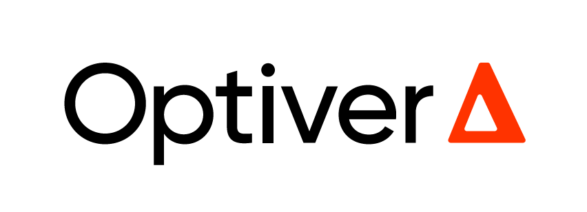

# Divided Oracle — QuantStorm 2026 (QATC IITD X FEC IITG X QUANT CLUB IITB)

<p align="center">
  <strong style="font-size: 20px;">Title Sponsors</strong>
</p>

<p align="center">
  
  &nbsp;&nbsp;&nbsp;&nbsp;&nbsp;&nbsp;
  
</p>

<p align="center">
  <strong style="font-size: 20px;">Associate Title Sponsor</strong>
</p>

<p align="center">
  
</p>

**Last Updated at: 8:55 PM, if your version is older please re-fetch the repository**


**Read** [**`RULEBOOK.md`**](RULEBOOK.md) **first. It is the complete specification.**

**Mandatory:** [Join the WhatsApp community for all updates and queries](https://chat.whatsapp.com/ELJQfcO8VUT3nmwhdXvhmw)

Your submission is **one `.py` file**. Copy `starter_bot.py`, fill it in, and
submit that.

## Quick start

```bash
python backtester.py --bot1 starter_bot.py --bot2 strategies/naive_ev.py
```

1. Copy `starter_bot.py` to `strategies/my_bot.py`.
2. Fill in the three metadata lines at the top — `Name`, `College`,
   `Roll Number`. A file that still has the placeholders is rejected.
3. Implement all five methods: `reset`, `bid`, `quote`, `respond`,
   `use_transform`.
4. Duel it against the baselines:

```bash
python backtester.py --bot1 strategies/my_bot.py --bot2 strategies/rational.py
```

5. Check it would be accepted:

```bash
python backtester.py --validate strategies/my_bot.py
```

6. Before you submit, confirm it behaves identically under tournament
   conditions:

```bash
python backtester.py --bot1 strategies/my_bot.py --bot2 strategies/rational.py --isolate
```

A different score with `--isolate` means your bot is relying on something
the tournament takes away — state carried between deals, a call over the
time limit, or a module-level cache.

## Requirements

Python 3.10 or newer. No third-party packages, at any point.

Your submission may import only `math`, `random`, `statistics`, `collections`,
`heapq`, `bisect`, `itertools`, `functools`, `typing`.

`from __future__ import annotations` is also permitted, and
`collections.namedtuple` and `typing.NamedTuple` both work, with or without it.

## What is here

|Path|Purpose|
|-|-|
|`RULEBOOK.md`|The complete rules, parameters and interface specification|
|`starter_bot.py`|Annotated template — copy this to begin|
|`backtester.py`|Duel two bots; `--validate` checks a submission would be accepted|
|`strategies/naive_ev.py`|Baseline: prices on its own coins, never bids|
|`strategies/rational.py`|Baseline: reads the opponent's quote, never bids|
|`strategies/adaptive_bidder.py`|Reference: reads quotes *and* values the auction|
|`engine.py`|The game engine — **do not modify**|
|`game_config.py`|Every tunable parameter — **do not modify**|
|`bot_loader.py`|The submission gate|
|`sandbox.py`, `policy.py`, `limits.py`|The isolation `--isolate` reproduces|

Modifying `engine.py` or `game_config.py` changes nothing about the tournament,
which runs its own copies. Change them only to experiment locally, and
re-derive anything you concluded from a modified spec.

## The two baselines are there for a reason

`rational` is `naive_ev` plus the entire pricing layer — it reads the
opponent's opening quote and infers their hand — and it still loses to anything
that bids in the auction. A bot that prices naively but bids sensibly beats a
bot that prices perfectly and never bids.

Beating the field takes both halves. Start by clearing `naive_ev`, then see how
you do against `adaptive_bidder`.

### [Live Leaderboard](https://www.tinyurl.com/quantstorm)

The live leaderboard is meant for fun and to give you an indication of how your bot is performing during the competition.

Your leaderboard score is the cumulative PnL of your bot against 10 standard bots on set seed, maintained by us. These standard bots are hidden, and the leaderboard does not represent the final competition results.

* Every new submission will overwrite your previous score and rank. There is no limit to the number of submissions.
* You must submit using the same email address you used to register on Unstop.
* Submissions made with a different email address will be auto-rejected.
* Use your real name and college name in the bot's comments, however you may keep any fun(but appropriate) name for the bot's file name.
* Validate your bot on the backtester locally before submission. Invalid bots will be auto-rejected.
* There is a 10 minute cooldown between submitting bots.

Use the leaderboard as a benchmark to experiment, improve, and see how your strategy is performing.


## Submission Guideline

A google form link will be shared in this README at 11:00PM, where you can submit your bot python file by 12:00PM, 18th August. Please follow all the guidelines mentioned in the rulebook for the submission.
**Note that you can only upload your final strategy once in the google form, so choose your final strategy wisely.**

UPDATE: Submission Link: FINAL SUBMISSION LINK
You will only be able to submit your bot once. Please be sure before submitting it.

https://docs.google.com/forms/d/e/1FAIpQLSchLJG_MH8QjPZWkz8FeMTRBdPBvPa6shaVjpFlO1e2rRD8aQ/viewform?usp=dialog


